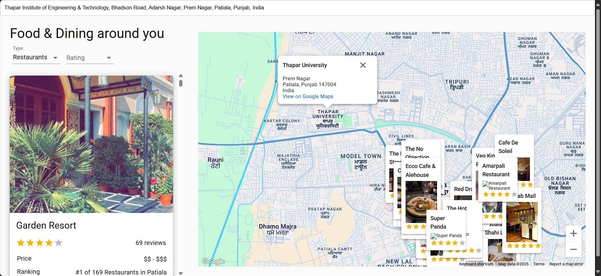

# Journey-Guide: Travel Advisor 🌍

Journey Guide is an advanced travel companion web app built with React. It offers powerful search, interactive Google Maps, real-time weather and curated recommendations for restaurants, hotels, and attractions—fetched using APIs.



## ✈️ Features

- **Interactive Google Maps**
- **Smart Search & Filtering**
- **Real-Time Data**
- **Modern UI/UX**
- **Developer-Focused Architecture**

## 🚀 Getting Started

### Prerequisites

- [Node.js](https://nodejs.org/) (v14 or later)
- [npm](https://www.npmjs.com/) (or yarn)

### Installation

1. **Clone the Repository**
```bash
git clone https://github.com/mannatsingla22/Journey-Guide.git
cd Journey-Guide
```

2. **Install Dependencies**
```bash
npm install
```


3. **Set up Environment Variables**
- Create a `.env` file in the root directory
- Add your **Google Maps API** key and required **RapidAPI** keys

4. **Run the App**
```bash
set NODE_OPTIONS=--openssl-legacy-provider && npm start
```

5. **Open in Browser**
- Visit `http://localhost:3000`
## 🛠️ Tech Stack

| Technology              | Purpose                             |
|-------------------------|-------------------------------------|
| React                   | Core UI library                     |
| React Router            | Client-side routing                 |
| Axios                   | HTTP requests                       |
| Node.js                 | Backend                             |
